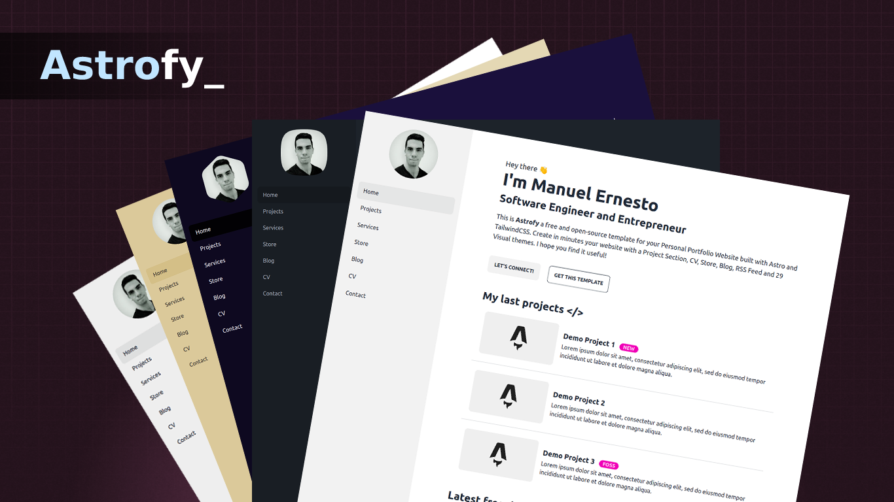

# Astrofy | Personal Portfolio Website Template



Astrofy is a free and open-source template for your Personal Portfolio Website built with Astro and TailwindCSS. Create in minutes a website with a Blog, CV, Project Section, Store, and RSS Feed.

## Demo

View a live demo of [Astrofy](https://astrofy-template.netlify.app/)

## Installation

Run the following command in your terminal

```bash
npm install
```

Once the packages are installed you are ready to run astro. Astro comes with a built-in development server that has everything you need for project development. The astro dev command will start the local development server so that you can see your new website in action for the very first time.

```bash
npm run dev
```

## Tech Stack

- [Astro](https://astro.build)
- [tailwindcss](https://tailwindcss.com/)
- [DaisyUI](https://daisyui.com/)

## Project Structure

```php
├── src/
│   ├── components/
│   │   ├── cv/
│   │   │   ├── TimeLine
│   │   ├── BaseHead.astro
│   │   ├── Card.astro
│   │   ├── Footer.astro
│   │   ├── Header.astro
│   │   └── HorizontalCard.astro
│   │   └── SideBar.astro
│   │   └── SideBarMenu.astro
│   │   └── SideBarFooter.astro
│   ├── content/
│   │   ├── blog/
│   │   │   ├── post1.md
│   │   │   ├── post2.md
│   │   │   └── post3.md
│   │   ├── store/
│   │   │   ├── item1.md
│   │   │   ├── item2.md
│   ├── layouts/
│   │   └── BaseLayout.astro
│   │   └── PostLayout.astro
│   └── pages/
│   │   ├── blog/
│   │   │   ├── [...page].astro
│   │   │   ├── [slug].astro
│   │   └── cv.astro
│   │   └── index.astro
│   │   └── projects.astro
│   │   └── rss.xml.js
│   └── styles/
│       └── global.css
├── public/
│   ├── favicon.svg
│   └── social-image.png
│   └── sprofile.jpg
│   └── social_img.webp
├── astro.config.mjs
├── tailwind.config.cjs
├── package.json
└── tsconfig.json
```

### Components usage

#### Layout Components

The `BaseHead`, `Footer`, `Header`, and `SideBar` components are already included in the layout system. To change the website content you can edit the content of these components.

##### SideBar

In the Sidebar you can change your profilePicture, links to all your website pages, and your social icons.

You can change your avatar shape using [mask classes](https://daisyui.com/components/mask/).

The used social-icons are SVG form [BoxIcons](https://boxicons.com/) pack. You can replace the icons in the `SideBarFooter` component

To add a new page in the sidebar go to the `SideBarMenu` component.

```
<li><a class="py-3 text-base" id="home" href="/">Home</a></li>

```

**Note**: In order to change the sidebar menu's active item, you need to setup the prop `sideBarActiveItemID` in the `BaseLayout` component of your new page and add that id to the link in the `SideBarMenu`

#### TimeLine

The timeline components are used to confirm the CV.

```html
<div class="time-line-container">
  <TimeLineElement title="Element Title" subtitle="Subtitle">
    Content that can contain
    <div>divs</div>
    and <span>anything else you want</span>.
  </TimeLineElement>
  ...
</div>
```

#### Card & HorizontalCard

The cards are primarly used for the Project and the Blog components. They include a picture, a title, and a description. 

```html
<HorizontalCard title="Card Title" img="imge_url" desc="Description" url="Link
URL" target="Optional link target (_blank default)" badge="Optional badge"
tags={['Array','of','tags']} />
```

#### HorizontalCard Shop Item


This component is already included in the Store layout of the template. In case you want to use it in another place these are the props.

```html
<HorizontalShopItem
  title="Item Title"
  img="imge_url"
  desc="Item description"
  pricing="current_price"
  oldPricing="old_price"
  checkoutUrl="external store checkout url"
  badge="Optional badge"
  url="item details url"
  custom_link="Custom link url"
  custom_link_label="Cutom link btn label"
  target="Optional link target (_self default)"
/>
```

#### Adding a Custom Component

To add a custom component, you can create a .astro file in the components folder under the source folder. 

Components must follow this template. The ```---``` represents the code fence and uses Javascript and can be used for imports. 

The HTML component is the actual style of your new component. 

```html
---
// Component Script (JavaScript)
---
<!-- Component Template (HTML + JS Expressions) -->
```

For more details, see the [astro components](https://docs.astro.build/en/core-concepts/astro-components/) documentation here. 

### Layouts

Include `BaseLayout` in each page you add and `PostLayout` to your post pages.

The BaseLayout defines a general template for each new webpage you want to add. It imports constants SITE_TITLE and SITE_DESCRIPTION which can be modified in the ```../config``` folder. Data placed there can be imported anywhere using import. 

### Content

You can add a [content collection](https://docs.astro.build/en/guides/content-collections/) in `/content/' folder, you will need add it at config.ts.

#### config.ts

Where you need to define your content collections, we define our content schemas too.

#### Blog

Add your `md` blog post in the `/content/blog/` folder.

##### Post format

Add code with this format in the top of each post file.

```
---
title: "Post Title"
description: "Description"
pubDate: "Post date format(Sep 10 2022)"
heroImage: "Post Hero Image URL"
---
```

### Pages

#### Blog

Blog uses Astro's content collection to query post's `md`.

##### [page].astro

The `[page].astro` is the route to work with the paginated post list. You can change there the number of items listed for each page and the pagination button labels.

##### [slug].astro

The `[slug].astro` is the base route for every blog post, you can customize the page layout or behaviour, by default uses `content/blog` for content collection and `PostLayout` as layout.

#### Shop

Add your `md` item in the `/pages/shop/` folder.

##### [page].astro

The `[page].astro` is the route to work with the paginated item list. You can change there the number of items listed for each page and the pagination button labels. The shop will render all `.md` files you include inside this folder.

##### Item format

Add code with this format at the top of each item file.

```js
---
title: "Demo Item 1"
description: "Item description"
heroImage: "Item img url"
details: true // show or hide details btn
custom_link_label: "Custom btn link label"
custom_link: "Custom btn link"
pubDate: "Sep 15 2022"
pricing: "$15"
oldPricing: "$25.5"
badge: "Featured"
checkoutUrl: "https://checkouturl.com/"
---
```

#### Static pages

The other pages included in the template are static pages. The `index` page belongs to the root page. You can add your pages directly in the `/pages` folder and then add a link to those pages in the `sidebar` component.

Feel free to modify the content included in the pages that the template contains or add the ones you need.

### Theming

To change the template theme change the `data-theme` attribute of the `<html>` tag in `BaseLayout.astro` file.

You can choose among 30 themes available or create your custom theme. See themes available [here](https://daisyui.com/docs/themes/).

## Sitemap

The Sitemap is generated automatically when you build your website in the root of the domain. Please update the `robots.txt` file in the public folder with your site name URL for the Sitemap.

## Deploy

You can deploy your site on your favourite static hosting service such as Vercel, Netlify, GitHub Pages, etc.

The configuration for the deployment varies depending on the platform where you are going to do it. See the [official Astro information](https://docs.astro.build/en/guides/deploy/) to deploy your website.

> **⚠️ CAUTION** </br>
> The Blog pagination of this template is implemented using dynamic route parameters in its filename and for now this format is incompatible with SSR deploy configs, so please use the default static deploy options for your deployments.

## Contributing

Suggestions and pull requests are welcomed! Feel free to open a discussion or an issue for a new feature request or bug.

One of the best ways to contribute is to grab a [bug report or feature suggestion](https://github.com/manuelernestog/astrofy/issues) that has been marked `accepted` and dig in.

Please be wary of working on issues _not_ marked as `accepted`. Just because someone has created an issue doesn't mean we'll accept a pull request for it.

## License

Astrofy is licensed under the MIT license — see the [LICENSE](https://github.com/manuelernestog/astrofy/blob/main/LICENSE) file for details.

## Contributors

<a href="https://github.com/manuelernestog/astrofy/graphs/contributors">
  
</a>

Made with [contrib.rocks](https://contrib.rocks).